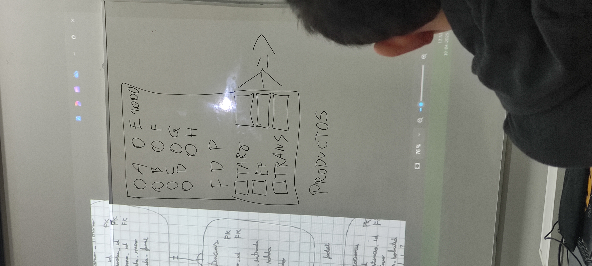

# Máquina Expendedora en PHP

Proyecto desarrollado como parte del curso **Desarrollo Backend I**, implementando el patrón **Modelo-Vista-Controlador (MVC)** en PHP. Este proyecto simula el funcionamiento de una máquina expendedora, enfocándose en las capas de Vista y Controlador.

## 🧠 Descripción

Este proyecto consiste en una simulación de una máquina expendedora, permitiendo a los usuarios seleccionar productos y realizar compras virtuales. La implementación se centra en las capas de Vista y Controlador del patrón MVC, omitiendo la capa de Modelo para simplificar la lógica y enfocarse en la interacción entre la interfaz de usuario y la lógica de control.

## 📁 Estructura del Proyecto

```
maquina-expendedora-php/
├── Controller/
│   └── VendingController.php
├── View/
│   └── vending_view.php
├── IMG_20250410_125313.jpg
└── index.php
```

- **Controller/**: Contiene la lógica de control, gestionando las solicitudes del usuario y determinando las respuestas apropiadas.
- **View/**: Incluye la interfaz de usuario, presentando las opciones disponibles y mostrando los resultados de las acciones del usuario.
- **index.php**: Punto de entrada principal de la aplicación, inicializa el controlador y carga la vista correspondiente.
- **IMG_20250410_125313.jpg**: Imagen de referencia de la máquina expendedora utilizada en el proyecto.

## 🚀 Cómo Ejecutar el Proyecto

1. **Requisitos Previos**:
   - Servidor web con soporte para PHP (por ejemplo, Apache o Nginx).
   - PHP instalado (versión 7.4 o superior recomendada).

2. **Pasos para la Ejecución**:
   - Clona este repositorio en el directorio raíz de tu servidor web:
     ```bash
     git clone https://github.com/hectorgm26/maquina-expendedora-php.git
     ```
   - Asegúrate de que el servidor web tenga acceso de lectura a los archivos del proyecto.
   - Accede a la aplicación a través de tu navegador web, navegando a la URL correspondiente (por ejemplo, `http://localhost/maquina-expendedora-php/`).

## 📸 Captura de Pantalla



## 📌 Notas Adicionales

- Este proyecto es una versión simplificada que omite la capa de Modelo para enfocarse en la interacción entre la Vista y el Controlador.
- Se recomienda utilizar este proyecto como base para aprender y experimentar con el patrón MVC en PHP.

## 📄 Licencia

Este proyecto está bajo la Licencia MIT. Consulta el archivo [LICENSE](LICENSE) para más detalles.
